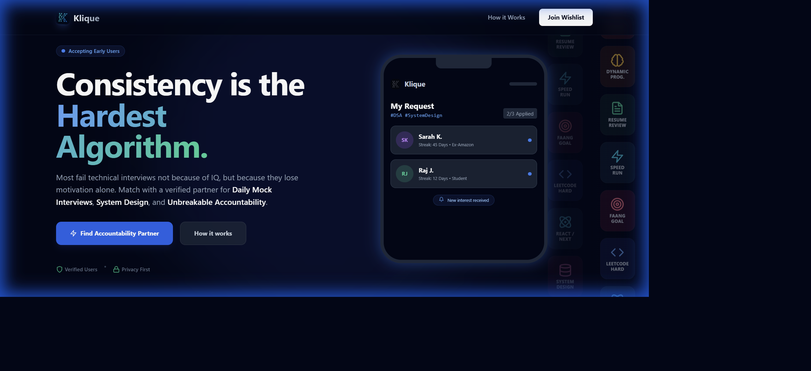
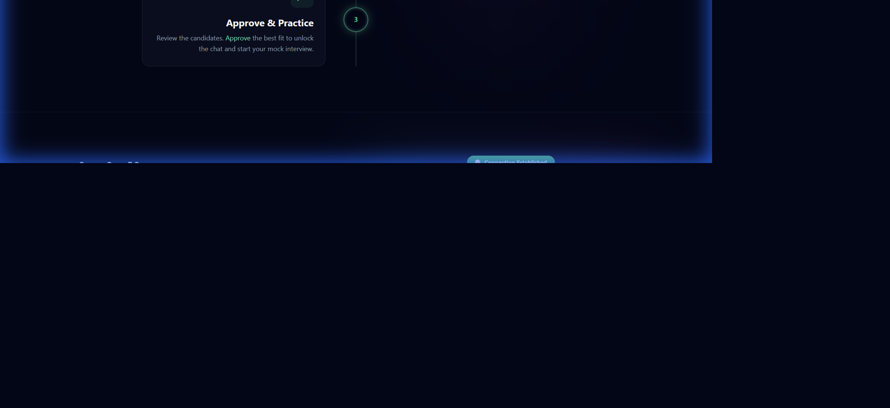

# BuddyMatch Landing Page

A beautiful, modern landing page for BuddyMatch - a platform to find accountability partners who share your goals and interests.

## Features

- 🎨 Premium dark theme design with vibrant gradients
- 🔥 Firebase Authentication & Firestore integration
- 📱 Fully responsive mobile-first design
- ✨ Smooth animations and micro-interactions
- 🚀 Built with React + Vite for blazing-fast performance
- 🎯 Dynamic match simulation showcase
- 📝 Wishlist signup with email validation

## Project Structure

```
buddy-match/
├── src/
│   ├── App.jsx           # Main application component
│   ├── main.jsx          # React entry point
│   ├── firebase.js       # Firebase configuration
│   └── index.css         # Global styles & animations
├── index.html            # HTML entry point
├── package.json          # Dependencies
├── vite.config.js        # Vite configuration
├── .env.example          # Environment variables template
└── README.md             # This file
```

## Setup Instructions

### 1. Install Dependencies

```bash
npm install
```

### 2. Configure Firebase

1. Go to [Firebase Console](https://console.firebase.google.com/)
2. Create a new project or select an existing one
3. Enable **Authentication** (Anonymous auth)
4. Enable **Firestore Database**
5. Get your Firebase config from Project Settings

### 3. Set Environment Variables

Create a `.env` file in the root directory:

```bash
cp .env.example .env
```

Then edit `.env` with your Firebase credentials:

```env
VITE_FIREBASE_API_KEY=your_api_key_here
VITE_FIREBASE_AUTH_DOMAIN=your_project.firebaseapp.com
VITE_FIREBASE_PROJECT_ID=your_project_id
VITE_FIREBASE_STORAGE_BUCKET=your_project.appspot.com
VITE_FIREBASE_MESSAGING_SENDER_ID=your_sender_id
VITE_FIREBASE_APP_ID=your_app_id
```

### 4. Run Development Server

```bash
npm run dev
```

The app will open at [http://localhost:3000](http://localhost:3000)

## Build for Production

```bash
npm run build
```

The production-ready files will be in the `dist/` folder.

## Preview Production Build

```bash
npm run preview
```

## Tech Stack

- **React 18** - UI framework
- **Vite 5** - Build tool & dev server
- **Firebase** - Authentication & Database
- **Lucide React** - Beautiful icon library
- **Vanilla CSS** - Custom animations & styling

## Components Overview

### Main Sections

- **Navbar** - Fixed navigation with smooth scroll links
- **Hero** - Eye-catching headline with animated match simulation
- **HowItWorks** - 3-step journey visualization
- **MeaningfulConnections** - Feature highlights with visual card
- **WhyDifferent** - Comparison tables and core values
- **FooterCTA** - Wishlist signup form with Firebase integration
- **Footer** - Copyright and links

### Custom Components

- **IconStream** - Animated vertical scrolling niche icons
- **MatchSimulation** - 4-step animated phone mockup showcase

## Firestore Data Structure

Wishlist signups are stored in:

```
artifacts/{appId}/users/{userId}/wishlist_signups/
  - email: string
  - goal: string
  - createdAt: timestamp
```

## Customization

### Colors

The app uses Tailwind-style utility classes with custom colors defined in CSS. Main color palette:
- Primary: Blue (#3B82F6)
- Secondary: Purple (#A855F7)
- Accent: Emerald (#10B981)
- Background: Slate (#020617, #0F172A, #1E293B)

### Fonts

Using **Plus Jakarta Sans** from Google Fonts. You can change this in `src/index.css`.

### Animations

Custom keyframe animations are defined in `src/index.css`:
- `scrollY` - Vertical scrolling icons
- `pulse-glow` - Glowing effect
- `slideUp` - Fade in from bottom

## Firebase Security Rules

Make sure to set up proper Firestore security rules:

```javascript
rules_version = '2';
service cloud.firestore {
  match /databases/{database}/documents {
    match /artifacts/{appId}/users/{userId}/wishlist_signups/{signupId} {
      allow read, write: if request.auth != null && request.auth.uid == userId;
    }
  }
}
```

## License

MIT License - Feel free to use this for your own projects!

## Support

For issues or questions, please open an issue on GitHub or contact support.

---

**Built with ❤️ using React + Vite + Firebase**

## Preview




